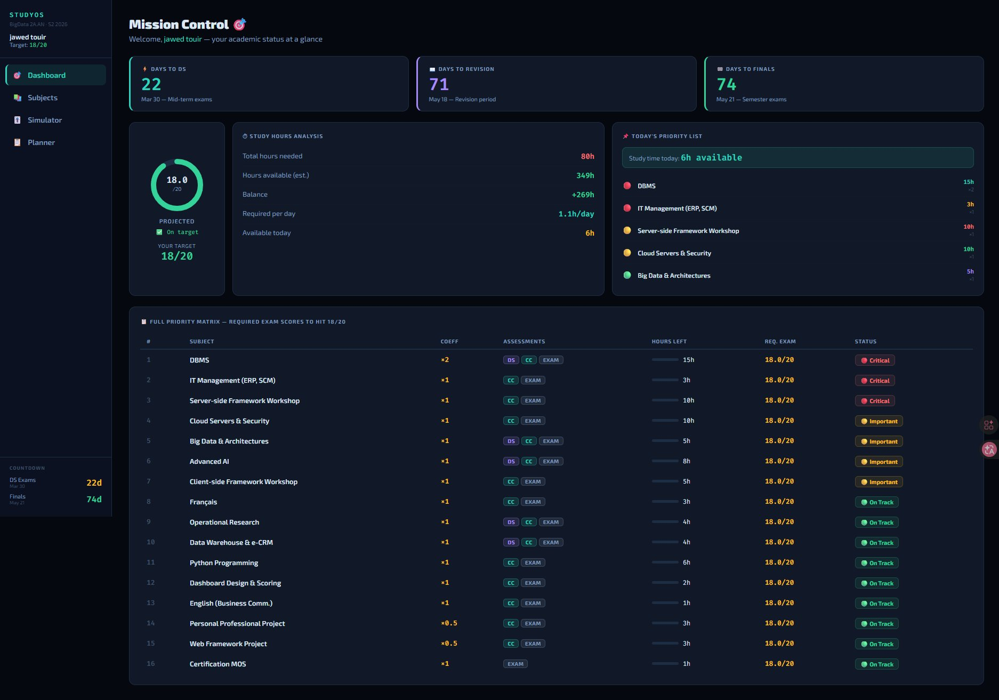
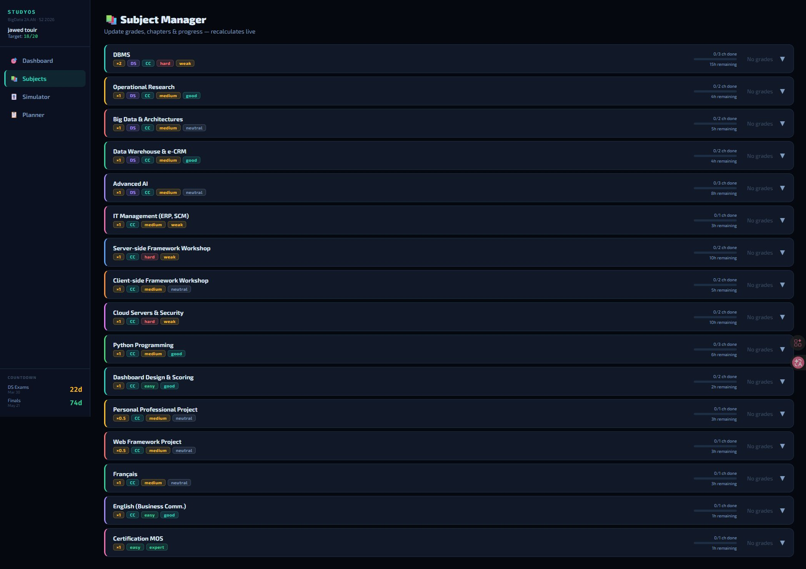
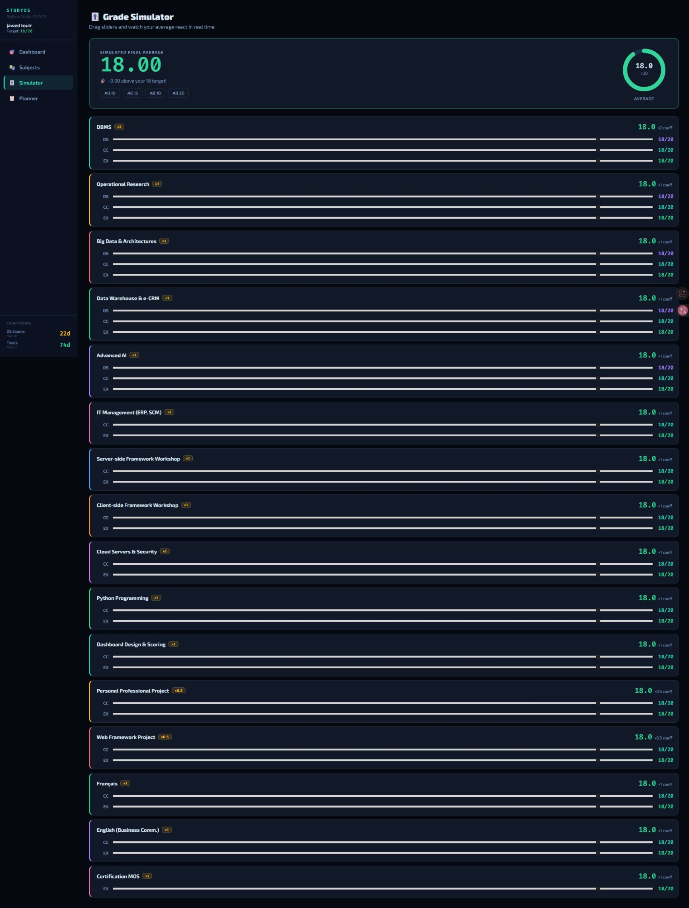
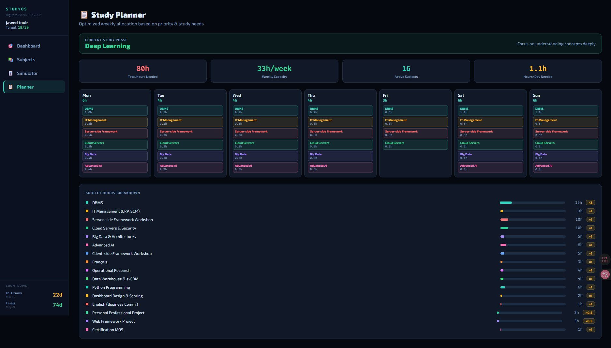

<div align="center">

# 🎯 STUDY MISSION CONTROL

[](https://git.io/typing-svg)

<br/>

[](https://react.dev)
[](https://fastapi.tiangolo.com)
[](https://python.org)
[](https://vitejs.dev)
[](LICENSE)

<br/>

> **A full-stack academic forecasting web app that tells you exactly how many hours**
> **you need to study to hit your target average — with real-time simulation & smart planning.**

<br/>

</div>

---

## 📸 Screenshots

<div align="center">

### 🎯 Dashboard — Live Countdown, Projected Average & Priority Matrix


<br/><br/>

<table>
<tr>
<td width="50%">

### 📚 Subject Manager


</td>
<td width="50%">

### 🎚️ Grade Simulator


</td>
</tr>
</table>

### 📋 Smart Study Planner


</div>

---

## ✨ What it does

<table>
<tr>
<td align="center" width="25%">
<br/>
<br/><br/>
Live countdown to DS and finals. Projected average ring gauge. Full priority matrix showing exactly what exam score each subject needs.
<br/><br/>
</td>
<td align="center" width="25%">
<br/>
<br/><br/>
Enter DS, CC and exam grades per subject. Track chapters done, hours studied. Required exam score recalculates instantly.
<br/><br/>
</td>
<td align="center" width="25%">
<br/>
<br/><br/>
Drag sliders for any grade scenario. Watch your weighted average update live. One-click presets like "what if I score 18 everywhere?"
<br/><br/>
</td>
<td align="center" width="25%">
<br/>
<br/><br/>
Auto-detects your study phase. Generates a weekly calendar with hours allocated per subject by priority. Subject breakdown bar chart.
<br/><br/>
</td>
</tr>
</table>

**The engine accounts for:**

| Input | Effect |
|-------|--------|
| Chapters per subject | More chapters = more hours needed |
| Difficulty (Easy to Very Hard) | Multiplies hours by 0.6x to 1.9x |
| Confidence (Expert to Lost) | Multiplies hours by 0.5x to 1.8x |
| Existing DS / CC grades | Calculates exact required exam score |
| Sleep schedule & free hours | Projects total available study time |
| Days remaining | Computes daily hours needed |
| Subject coefficient | Weights priority ranking |

---

## ⚡ Quick Start

> Get running in under 5 minutes.

**Prerequisites:** Node.js v18+ and Python 3.10+

### 🐍 Backend (FastAPI)

```bash
cd backend
python -m venv venv

# Git Bash / Mac / Linux:
source venv/Scripts/activate

# Install and run
pip install -r requirements.txt
uvicorn main:app --reload --port 8000
```

✅ API running at `http://localhost:8000`
📖 Swagger docs at `http://localhost:8000/docs`

---

### ⚛️ Frontend (React + Vite)

Open a second terminal:

```bash
cd frontend
npm install
npm run dev
```

✅ App running at `http://localhost:5173`

---

## 📁 Project Structure

```
study-mission-control/
│
├── frontend/
│   ├── src/
│   │   ├── App.jsx        # Full application UI
│   │   └── main.jsx       # React entry point
│   ├── index.html
│   ├── package.json
│   └── vite.config.js
│
├── backend/
│   ├── main.py            # API routes and forecasting engine
│   └── requirements.txt
│
└── README.md
```

---

## 🧠 Grading Formula

**Subjects with DS + CC:**
```
Final = (DS×1 + CC×1 + EXAM×2) / 4
```

**Subjects with CC only:**
```
Final = (CC×1 + EXAM×2) / 3
```

**Required exam score to hit target T:**
```
With DS+CC:  EXAM = (4×T - DS - CC) / 2
With CC:     EXAM = (3×T - CC) / 2
```

**Weighted semester average:**
```
Average = Σ(grade × coeff) / Σ(coeff)
```

---

## 🔌 API Reference

| Method | Endpoint | Description |
|--------|----------|-------------|
| `GET` | `/` | Health check |
| `GET` | `/api/dates` | Key semester dates |
| `POST` | `/api/forecast` | Full study forecast engine |
| `POST` | `/api/simulate` | Grade simulation |
| `GET` | `/api/health` | Server status |

---

## 📊 Subjects — BigData 2A.AN S2

| Subject | Coeff | DS | CC | Exam |
|---------|-------|----|----|------|
| DBMS | **×2** | ✅ | ✅ | ✅ |
| Operational Research | ×1 | ✅ | ✅ | ✅ |
| Big Data & Architectures | ×1 | ✅ | ✅ | ✅ |
| Data Warehouse & e-CRM | ×1 | ✅ | ✅ | ✅ |
| Advanced AI | ×1 | ✅ | ✅ | ✅ |
| IT Management (ERP, SCM) | ×1 | ❌ | ✅ | ✅ |
| Server-side Framework Workshop | ×1 | ❌ | ✅ | ✅ |
| Client-side Framework Workshop | ×1 | ❌ | ✅ | ✅ |
| Cloud Servers & Security | ×1 | ❌ | ✅ | ✅ |
| Python Programming | ×1 | ❌ | ✅ | ✅ |
| Dashboard Design & Scoring | ×1 | ❌ | ✅ | ✅ |
| Personal Professional Project | ×0.5 | ❌ | ✅ | ✅ |
| Web Framework Project | ×0.5 | ❌ | ✅ | ✅ |
| Français | ×1 | ❌ | ✅ | ✅ |
| English (Business Comm.) | ×1 | ❌ | ✅ | ✅ |
| Certification MOS | ×1 | ❌ | ❌ | ✅ |

---

## 📅 Key Dates — S2 2025/2026

| Event | Date |
|-------|------|
| 🟡 DS Exams | Mar 30 – Apr 4, 2026 |
| 📖 Revision Period | May 18–20, 2026 |
| 🔴 Final Exams | May 21–30, 2026 |
| 📋 Results | June 9, 2026 |
| 🔄 Retake Session | June 15–20, 2026 |

---

## ❓ Troubleshooting

| Problem | Fix |
|---------|-----|
| `venvScriptsactivate: command not found` | Use `source venv/Scripts/activate` in Git Bash |
| `npm: command not found` | Install Node.js from nodejs.org |
| Port 8000 in use | Run `uvicorn main:app --reload --port 8001` |
| White screen | Open browser console (F12) for errors |

---

<div align="center">

**Built for EPIDS · BigData 2A.AN · S2 2025/2026**

*React + FastAPI · Runs fully local · No API keys required*

</div>
